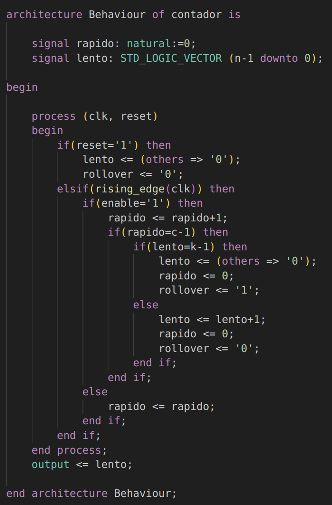

# Sobre o Projeto
Esse projeto é a implementacao da parte IV do [exercicio](lab5.pdf) proposto na disciplina SSC108 

# Resumo
Este projeto implementa um sistema de codificação Morse usando uma Máquina de Estados Finitos (FSM) para controlar LEDs e contadores, simulando traços e pontos com base nas entradas fornecidas pelos switches (alfabeto de A à H). Todo o projeto foi realizado em vhdl, enquanto o teste de seu funcionamento foi feito em uma FPGA  .

# Implementação
O funcionamento da FSM segue a seguinte lógica:
1. As entradas dos switches são convertidas em um vetor de bits que representa traços e pontos do código Morse.
2. O vetor de bits é salvo no shift register.
3. O bit mais à esquerda do shift register é lido:
    - Se o bit for 0 (ponto), o LED acende por 0,5 segundos.
    - Se o bit for 1 (traço), o LED acende por 1,5 segundos.
4. Após o contador finalizar, o LED é apagado por 0,1 segundos.
5. O próximo bit do shift register é lido e o processo é repetido até que todos os bits sejam processados.
6. Quando todos os bits são processados, o sistema volta ao estado inicial (IDLE).
### RESET ASSÍNCRONO
Implementamos um reset assíncrono ara grantir o funcionamento adequado do projeto

## ESTADOS

### IDLE
Estado inicial, onde o circuito aguarda a liberação do reset. Uma vez liberado, o sistema prepara o shift register para começar a leitura dos bits.

### SHIFT

O shift register é ativado, e o próximo bit é lido. Dependendo do bit (0 ou 1), o sistema decide qual contador acionar:

- Se o bit for 0, vai para o estado COUNTER_0_5.

- Se o bit for 1, vai para o estado COUNTER_1_5.

### COUNTER_0_5
O LED é acesso por 0,5 segundos utilizando um contador ligado ao clock da FPGA

### COUNTER_1_5
O LED é acesso por 1,5 segundos utilizando um contador ligado ao clock da FPGA

### COUNTER_LOW
O LED é desativado por 0,1 segundos utilizando um contador ligado ao clock da FPGA

## COMPONENTES

### SWITCHES
As entradas são mapeadas para um vetor de bits que representa traços (0) e pontos (1). Além disso com base na entrada fornecida o tamanho do vetor também é armazenado em uma variável que irá ser importante para o funcionamento adequado do shifter.

### SHIFT REGISTER
Armazena o vetor de bits de traços e pontos e processa um bit de cada vez, relizando o deslocamento dos bits para fazer sua leitura.

### CONTADORES 
Três contadores controlam o tempo de acendimento dos LEDs e o intervalo de apagamento:    
- Contador de 0,5 segundos para os pontos.
- Contador de 1,5 segundos para os traços.
- Contador de 0,1 segundos para o intervalo de apagamento do LED.

## DIAGRAMA DA FSM

