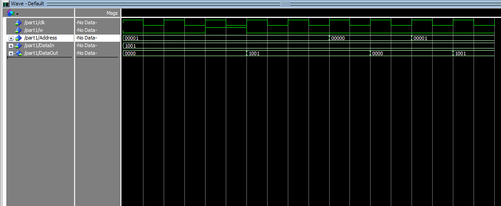
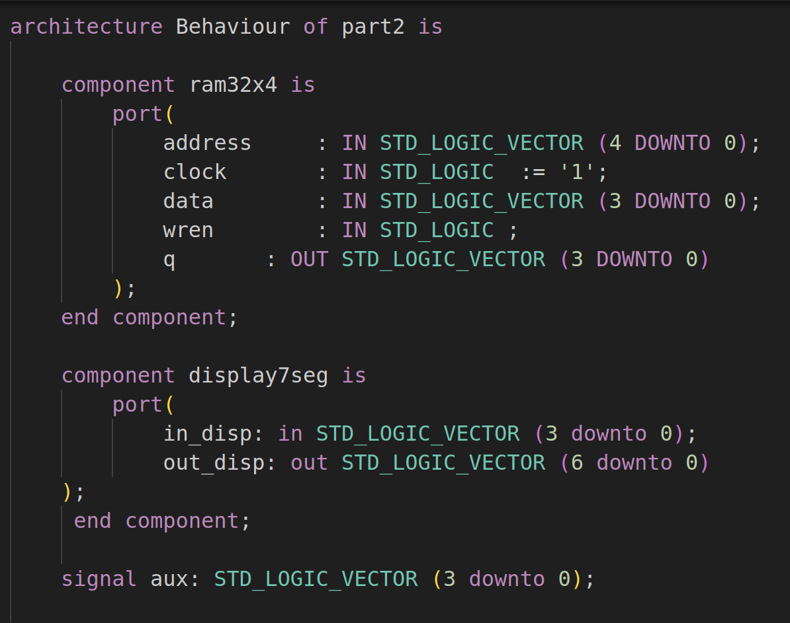
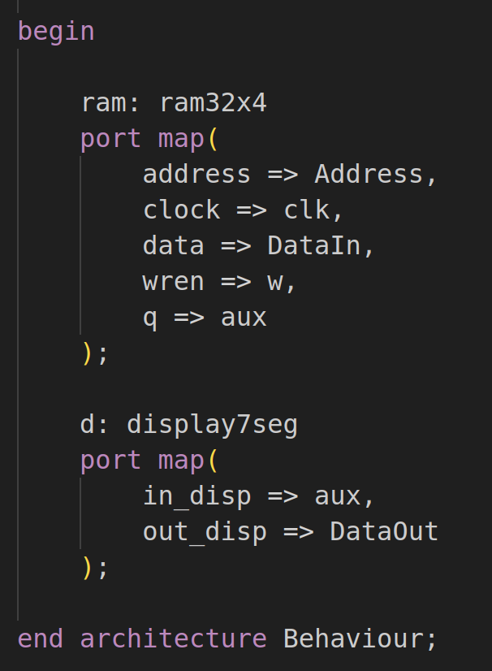
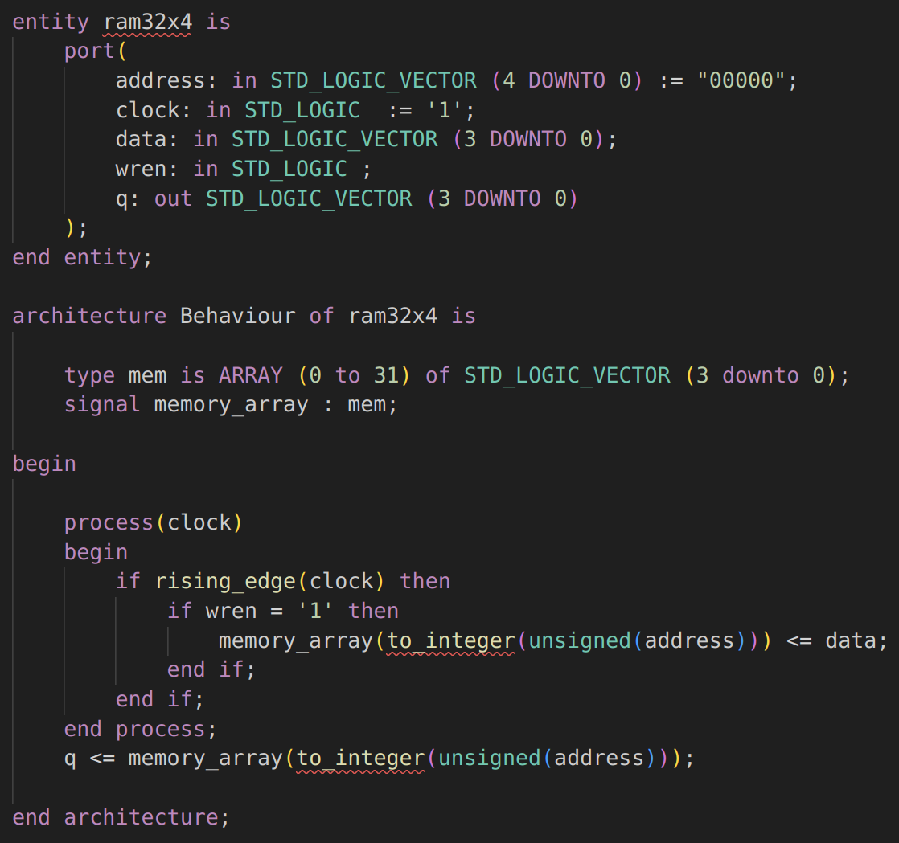
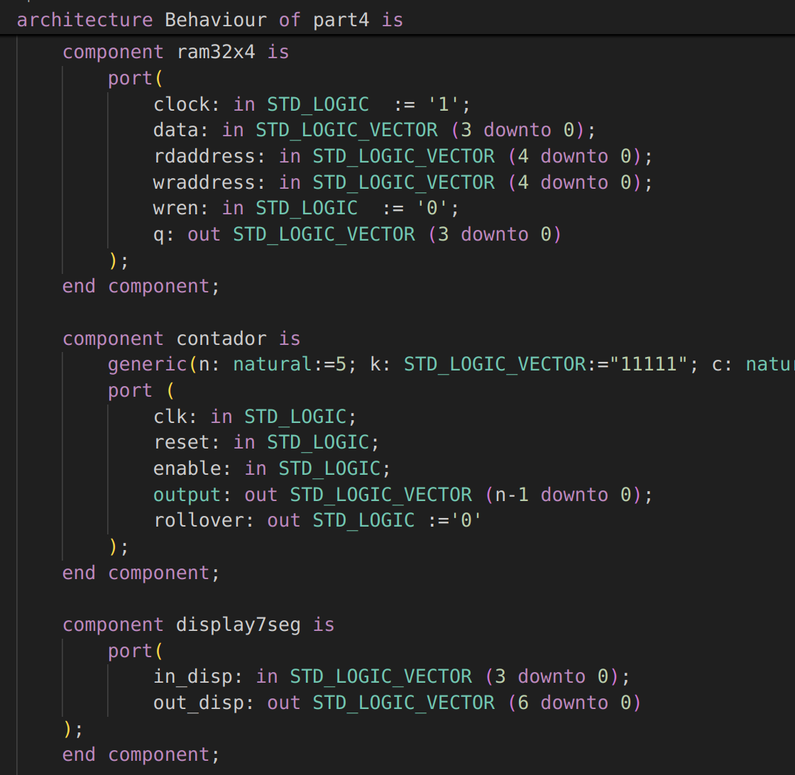
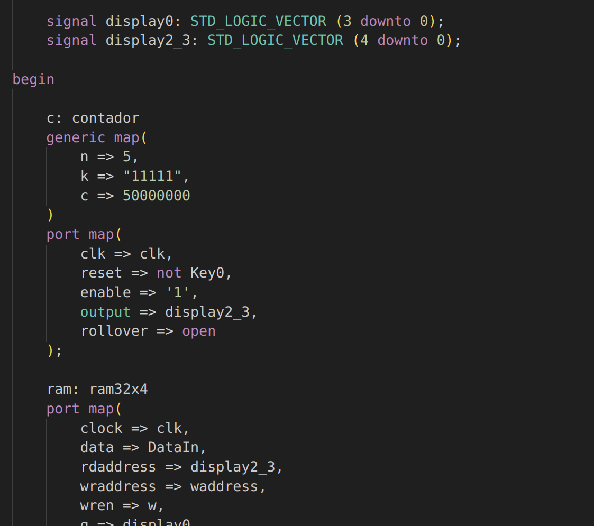
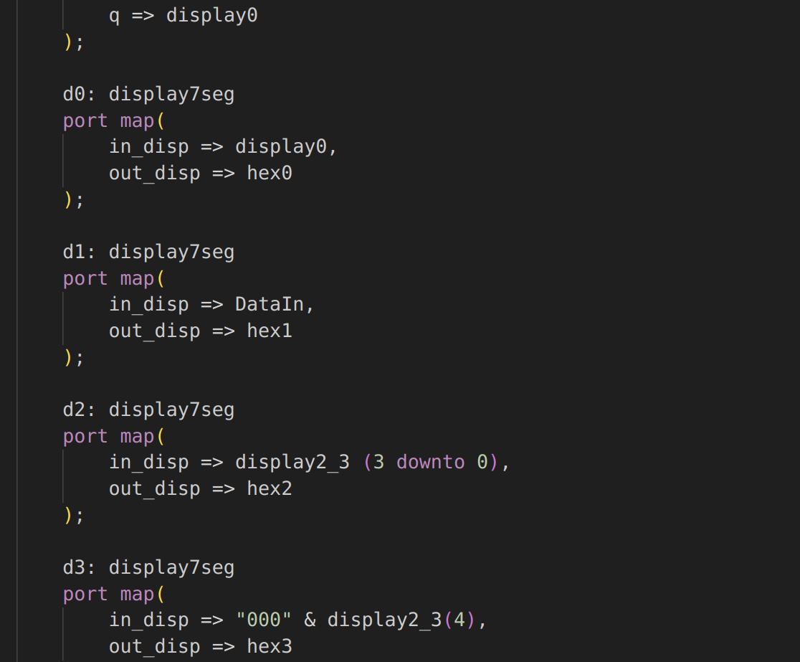
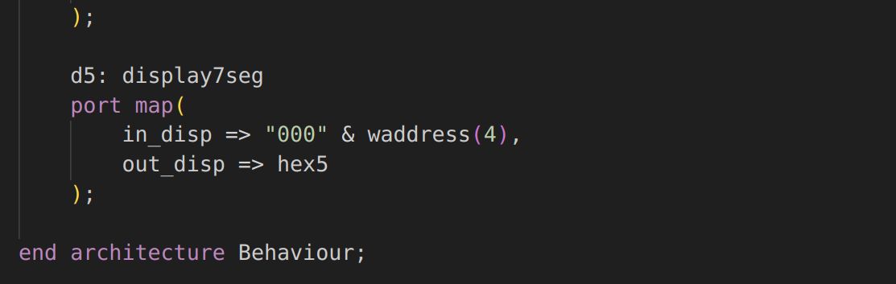

# Sobre o Projeto
Esse projeto é a implementação do [exercício proposto](lab8.pdf) na disciplina Prática em Sistemas Digitais (SSC108) ministrada pelo docente Vanderlei Bonato 

# Resumo
Este projeto serve como uma introdução aos blocos de memória em sistemas digitais, com o intuito de familiarizar os alunos as diferentes formas de implementar blocos de memória RAM (Random Access Memory) em uma FPGA. Os exercícios foram realizados utilizando as plataformas Quartus e Modelsim, além disso trabalhamos com VHDL quando necessário. 

## Parte I
No primeiro exercício utilizamos a ferramenta do Quartus de módulos pré-construídos de circuitos lógicos comumente utilizados. O bloco de memória foi [instanciado em um código de VHDL](part1/part1.vhd), pudemos então verificar no compilador do Quartus o tamanho que o bloco foi especificado para ocupar, além disso, seu comportamento foi simulado no ModelSim.
### Tamanho

### Simulação

## Parte II
Na parte II utilizamos uma FPGA para demonstrar visualmente o comportamento de uma memória RAM, para tal utilizamos o mesmo sistema de módulos do exercício anterior. Na placa foi possível utilizar dos LEDs e switches para gravar e exibir a memória em diferentes endereços.
### [Top Level Design](part2/part2.vhd)

## Parte III
Nesse exercício utilizamos o mesmo Top Level Design para exibir o comportamento da RAM na FPGA, a diferença para o exercício anterior foi que dessa vez implementamos a memória diretamente em VHDL, sem utilizar os circuitos lógicos prontos do Quartus.
### [Implementacao da RAM](part3/ram32x4.vhd)

## Part IV
Para a parte IV utilizamos um modulo de memória com o comportamento levemente diferente, no qual uma porta é responsável por ler o conteúdo do endereço enquanto uma distinta tem a função de escrever em outro endereço. Para exibir esse novo comportamento utilizamos uma FPGA.
### [Top Level Design](part4/part4.vhd)

