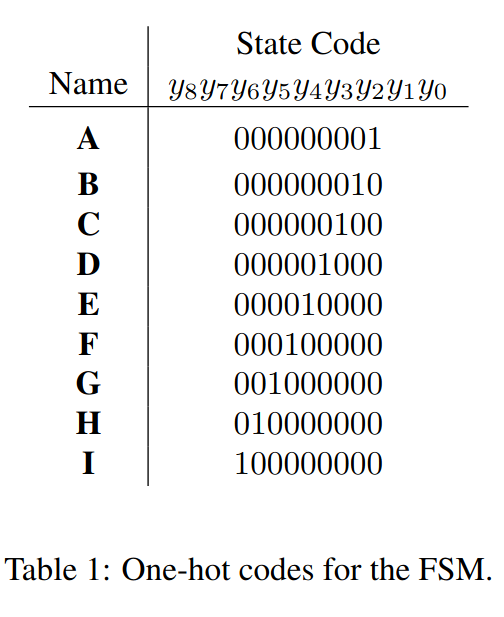
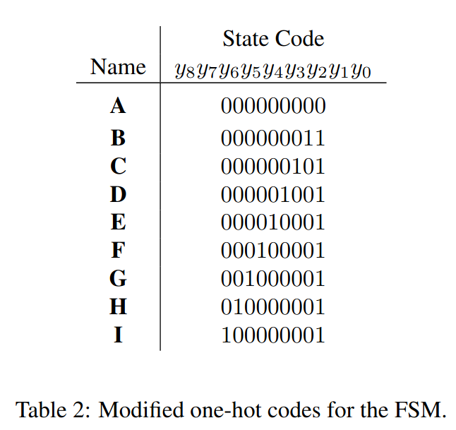

# Sobre o Projeto
Esse projeto é a implementação das partes I e IV dos [exercícios propostos](lab7.pdf) na disciplina Prática em Sistemas Digitais (SSC108) ministrada pelo docente Vanderlei Bonato 

# Resumo
Os exercícios realizados nesse projeto tratam de uma introdução a Maquinas de Estados Finitos (FSM) com o intuito de familiarizar os alunos ao conceito tão primordial nos sistemas digitais. Os exercícios foram realizados utilizando as plataformas Quartus e Modelsim, além disso trabalhamos com VHDL quando necessário e realizamos testes do circuito em uma FPGA. 

# Parte I
A FSM implementada reconhece duas sequencias de um dado input: quatro 0's seguidos ou quatro 1's seguidos. A maquina possui um input w que ira determinar a sequência e um output z que possui uma saída padrão 0, no entanto, quando a sequencia é detectada, z tem seu valor estabelecido para 1. Vale ressaltar que a sobreposição de sequencias é possível, ou seja, após uma sequencia, o output z deve manter seu valor lógico em 1 enquanto não ocorrer mudanças no valor de w.
Essa parte foi realizada em duas etapas com alterações apenas no codigo de estado   entre elas, a primeira aplicação foi testada no Modelsim e na FPGA, enquanto a segunda foi testada apenas na FPGA. A FSM possui nove estados sendo um deles o reset.

## Implementação 
Para exibir o estado atual da FSM foi requisitado que utilizassemos nove flip flops instanciados. Na FPGA o estado foi exibido a partir dos LEDs conectados a cada um dos flip flops, um dos switches ficou designado ao reset enquanto o clock ficou designado ao um dos botões. 

## Diagrama
 

### Diagrama de Tempo 

## Etapa I
Nessa etapa o código de estados fornecido para utilizarmos foi o seguinte:

 
### Top Level Design
 ->> imagem

### Flip Flops Instanciados
 ->> imagem

### Simulação 

## Etapa II
Nessa etapa o código de estados fornecido para utilizarmos foi o seguinte:

### Alterações no Código
-> imagem 

# Parte IV
A parte quatro consiste na implementação do código morse do projeto anterior, com a mudança que se torna obrigatório o uso de uma FSM, no entanto já utilizamos uma Maquina de Estado Finitos para a resolução desse projeto, é possível conferir os detalhes [aqui](../projeto_03). 

