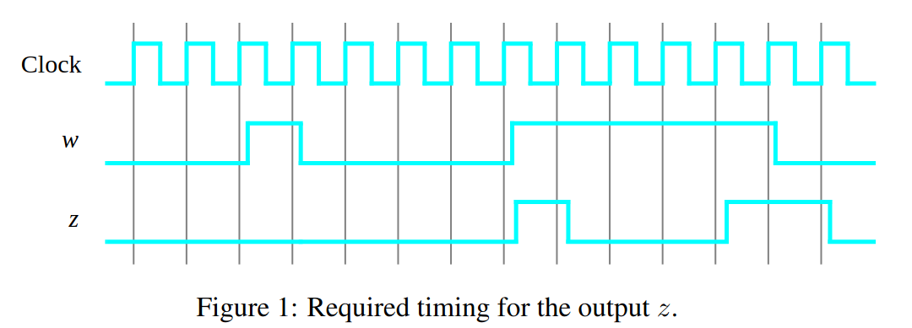
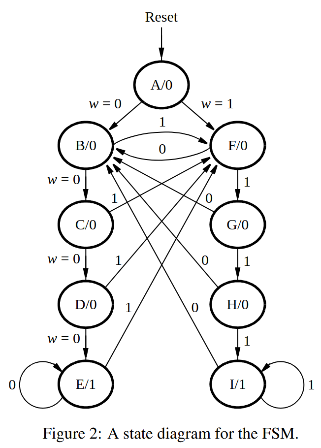

# Sobre o Projeto
Esse projeto é a implementação das partes I e IV dos [exercícios propostos](lab7.pdf) na disciplina Prática em Sistemas Digitais (SSC108) ministrada pelo docente Vanderlei Bonato 

# Resumo
Os exercícios realizados nesse projeto tratam de uma introdução a Maquinas de Estados Finitos (FSM) com o intuito de familiarizar os alunos ao conceito tão primordial nos sistemas digitais. Os exercícios foram realizados utilizando as plataformas Quartus e Modelsim, além disso trabalhamos com VHDL quando necessário e realizamos testes do circuito em uma FPGA. 

# Parte I
O primeiro exercício consistiu na implementação de uma FSM simples em duas etapas. Na primeira etapa, implementamos FSM com oito estados, já na segunda fizemos breves alterações no código para incluir um nono estado de reset. A primeira aplicação foi testada no Modelsim e na FPGA, enquanto a segunda foi testada apenas na FPGA.

## Etapa I
Nessa etapa implementamos uma FSM que reconhece duas sequencias de um dado input: quatro 0's seguidos ou quatro 1's seguidos. A maquina possui um input w que ira determinar a sequência e um output z que possui uma saída padrão 0, no entanto, quando a sequencia é detectada, z tem seu valor estabelecido para 1. Vale ressaltar que a sobreposição de sequencias é possível, ou seja, após uma sequencia, o output z deve manter seu valor lógico em 1 enquanto não ocorrer mudanças no valor de w.
### Diagrama de Tempo 

 
 ### Top Level Design
 ->> imagem

 ### Flip Flops Instanciados
 ->> imagem

 ### Simulação 

 ## Etapa II
 Essa etapa consistiu na atualização da FSM realizada anteriormente adicionando um nono estado para a máquina, o reset. Esse estado seta todos os outputs dos flip flops utilizados para 0.

 ### Alterações no Código
 -> imagem 

 ## Diagrama Final da FSM
 

 # Parte IV
 A parte quatro consiste na implementação do código morse do projeto anterior, com a mudança que se torna obrigatório o uso de uma FSM, no entanto já utilizamos uma Maquina de Estado Finitos para a resolução desse projeto, é possível conferir os detalhes [aqui](../projeto_03). 

