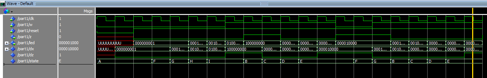
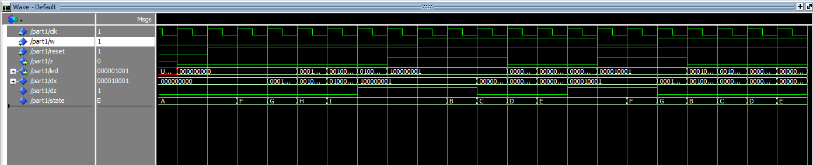

# Sobre o Projeto
Esse projeto é a implementação das partes I e IV dos [exercícios propostos](lab7.pdf) na disciplina Prática em Sistemas Digitais (SSC108) ministrada pelo docente Vanderlei Bonato 

# Resumo
Os exercícios realizados nesse projeto tratam de uma introdução a Maquinas de Estados Finitos (FSM) com o intuito de familiarizar os alunos ao conceito tão primordial nos sistemas digitais. Os exercícios foram realizados utilizando as plataformas Quartus e Modelsim, além disso trabalhamos com VHDL quando necessário e realizamos testes do circuito em uma FPGA. 

# Parte I
A FSM implementada reconhece duas sequencias de um dado input: quatro 0's seguidos ou quatro 1's seguidos. A maquina possui um input w que ira determinar a sequência e um output z que possui uma saída padrão 0, no entanto, quando a sequencia é detectada, z tem seu valor estabelecido para 1. Vale ressaltar que a sobreposição de sequencias é possível, ou seja, após uma sequencia, o output z deve manter seu valor lógico em 1 enquanto não ocorrer mudanças no valor de w.
Essa parte foi realizada em duas etapas com alterações apenas no codigo de estado   entre elas, a primeira aplicação foi testada no Modelsim e na FPGA, enquanto a segunda foi testada apenas na FPGA. A FSM possui nove estados sendo um deles o reset.

## Implementação 
Para exibir o estado atual da FSM foi requisitado que utilizassemos nove flip flops instanciados. Na FPGA o estado foi exibido a partir dos LEDs conectados a cada um dos flip flops, um dos switches ficou designado ao reset enquanto o clock ficou designado ao um dos botões. 

## Diagrama
 

### Diagrama de Tempo 


## Etapa I
Nessa etapa o código de estados fornecido para utilizarmos foi o seguinte:


 
### Top Level Design
``` vhdl
process(clk)
begin
    if rising_edge(clk) then
		if reset = '0' then
			state <= A;
			dz <= '0';
            dx <= "000000000";
		else 
			case state is
            when A =>
                dz <= '0';
                dx <= "000000000";
                if w = '1' then
                    state <= B;
                elsif w = '0' then
                    state <= F;
                end if;
            when B =>
                dz <= '0';
                dx <= "000000011";
                if w = '1' then
                    state <= C;
                elsif w = '0' then 
                    state <= F;
                end if;
            when C =>
                dz <= '0';
                dx <= "000000101";
                if w = '1' then
                    state <= D;
                elsif w = '0' then 
                    state <= F;
                end if;
            when D =>
                dz <= '0';
                dx <= "000001001";
                if w = '1' then
                    state <= E;
                elsif w = '0' then 
                    state <= F;
                end if;
            when E =>
                dz <= '1';
                dx <= "000010001";
                if w = '1' then
                    state <= E;
                elsif w = '0' then 
                    state <= F;
                end if;
            when F =>
                dz <= '0';
                dx <= "000100001";
                if w = '1' then
                    state <= B;
                elsif w = '0' then  
                    state <= G;
                end if;
            when G =>
                dz <= '0';
                dx <= "001000001";
                if w = '1' then
                    state <= B;
                elsif w = '0' then 
                    state <= H;
                end if;
            when H =>
                dz <= '0';
                dx <= "010000001";
                if w = '1' then
                    state <= B;
                elsif w = '0' then  
                    state <= I;
                end if;
            when I =>
                dz <= '1';
                dx <= "100000001";
                if w = '1' then
                    state <= B;
                elsif w = '0' then
			    	state <= I;
                end if;
        end case;
		end if;
   end if;
end process;
```


### Flip Flops Instanciados
``` vhdl
entity ff is
	port(
		clk : in STD_LOGIC;
		data : in STD_LOGIC;
		q : out STD_LOGIC
	);
end entity;

architecture Behaviuour of ff is
begin
	process(clk)
	begin
		if rising_edge(clk) then
			q <= data;
		end if;
	end process;
end architecture;
```

### Simulação 
 


## Etapa II
Nessa etapa o código de estados fornecido para utilizarmos foi o seguinte:


### Nova simulação
 


# Parte IV
A parte quatro consiste na implementação do código morse do projeto anterior, com a mudança que se torna obrigatório o uso de uma FSM, no entanto já utilizamos uma Maquina de Estado Finitos para a resolução desse projeto, é possível conferir os detalhes [aqui](../projeto_03). 


